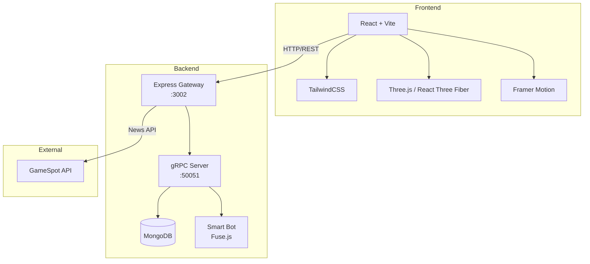

# 📊 Laporan Teknologi Stack - GamerZone TopUp

## 📁 Ringkasan Proyek

| Aspek | Detail |
|-------|--------|
| **Nama Proyek** | GamerZone TopUp |
| **Tipe** | Web Application (Full-Stack) |
| **Arsitektur** | Microservices dengan API Gateway |
| **Protokol** | REST API + gRPC |

---

## 📖 Glosarium / Istilah Dasar

Berikut adalah tabel istilah teknis dasar yang digunakan dalam proyek ini untuk memudahkan pemahaman bagi developer atau pemangku kepentingan:

| Istilah | Penjelasan Sederhana |
|---------|-----------------------|
| **Framework** | Kerangka kerja atau 'cetakan' yang mempercepat pembuatan aplikasi (cth: React, Express). |
| **Backend** | Bagian aplikasi yang berjalan di server, mengelola database dan logika keamanan. |
| **Frontend** | Bagian aplikasi yang dilihat langsung oleh user (Antarmuka/UI). |
| **REST API** | Cara standar bagi aplikasi untuk 'berkomunikasi' menggunakan protokol HTTP (seperti membuka alamat web). |
| **gRPC** | Teknologi Google untuk komunikasi antar server yang sangat cepat menggunakan pesan biner. |
| **Database (NoSQL)** | Tempat penyimpanan data non-tabel (fleksibel), seperti MongoDB yang menyimpan data dalam format JSON. |
| **ODM (Mongoose)** | Alat bantu di Node.js untuk memudahkan penulisan perintah ke database MongoDB. |
| **SPA (Single Page App)** | Aplikasi web yang tidak perlu 'muat ulang' seluruh halaman saat pindah menu (sangat cepat). |
| **Rendering (3D)** | Proses menghasilkan gambar visual dari model 3D menggunakan kode komputer (Three.js). |
| **Protocol Buffers** | Format data yang dikompresi agar pengiriman pesan chat menjadi lebih ringan dan cepat. |
| **Utility-First CSS** | Metode styling (desain) menggunakan kelas-kelas kecil siap pakai (Tailwind) daripada menulis CSS manual. |
| **Middleware** | 'Satpam' perantara yang memeriksa keamanan atau data request sebelum sampai ke logika utama server. |
| **CRUD** | Singkatan dari Create, Read, Update, Delete (proses dasar pengelolaan data). |
| **Endpoint** | Alamat spesifik di server (URL) yang digunakan untuk mengambil atau mengirim data tertentu. |
| **Sandbox / Mocking** | Lingkungan simulasi untuk mencoba fitur (seperti pembayaran) tanpa menggunakan data atau uang sungguhan. |
| **Environment Variables** | Kunci rahasia atau pengaturan (seperti password database) yang disimpan di luar kode utama demi keamanan. |

---

## 🖥️ Backend Stack

### Bahasa Pemrograman
| Bahasa | Versi | Penggunaan |
|--------|-------|------------|
| **JavaScript (Node.js)** | ES2020+ (ES Modules) | Server-side logic, API endpoints, gRPC services |
| **Protocol Buffers (proto3)** | v3 | Definisi kontrak gRPC services |

### Framework & Runtime
| Framework | Versi | Fungsi |
|-----------|-------|--------|
| **Express.js** | ^4.18.2 | REST API Gateway - routing HTTP requests |
| **Node.js** | ES Modules | Runtime environment |

### Database
| Database | Versi | Fungsi |
|----------|-------|--------|
| **MongoDB** | via Mongoose ^8.0.0 | Primary database untuk games, transactions, users |
| **MongoDB Memory Server** | ^11.0.1 | In-memory database untuk development/testing |

### gRPC Stack
| Library | Versi | Fungsi |
|---------|-------|--------|
| **@grpc/grpc-js** | ^1.10.0 | gRPC client/server implementation untuk Node.js |
| **@grpc/proto-loader** | ^0.7.10 | Dynamic proto file loader |
| **google-protobuf** | ^3.21.2 | Protocol Buffers runtime library |

### Utility Libraries
| Library | Versi | Fungsi |
|---------|-------|--------|
| **axios** | ^1.6.0 | HTTP client untuk external API calls |
| **cors** | ^2.8.5 | Cross-Origin Resource Sharing middleware |
| **dotenv** | ^16.4.0 | Environment variable management |
| **body-parser** | ^1.20.2 | Parse incoming request bodies |
| **firebase** | ^10.0.0 | Firebase integration (auth/storage) |
| **fuse.js** | ^7.0.0 | Fuzzy search untuk smart bot responses |
| **uuid** | ^9.0.1 | Generate unique identifiers |

---

## 🎨 Frontend Stack

### Bahasa Pemrograman
| Bahasa | Penggunaan |
|--------|------------|
| **JavaScript (ES6+)** | React components, business logic |
| **JSX** | React component templates |
| **CSS/PostCSS** | Styling dengan TailwindCSS |

### Framework & Build Tools
| Framework | Versi | Fungsi |
|-----------|-------|--------|
| **React** | ^18.2.0 | UI component library |
| **React DOM** | ^18.2.0 | React rendering untuk browser |
| **Vite** | ^5.2.0 | Build tool & development server |

### UI & Styling
| Library | Versi | Fungsi |
|---------|-------|--------|
| **TailwindCSS** | ^3.4.1 | Utility-first CSS framework |
| **PostCSS** | ^8.4.38 | CSS transformation |
| **Autoprefixer** | ^10.4.19 | Add vendor prefixes automatically |
| **Lucide React** | ^0.360.0 | Icon library |

### Animation & 3D Graphics
| Library | Versi | Fungsi |
|---------|-------|--------|
| **Framer Motion** | ^11.0.0 | Animation library untuk React |
| **Three.js** | ^0.160.0 | 3D graphics library |
| **@react-three/fiber** | ^8.16.0 | React renderer untuk Three.js |
| **@react-three/drei** | ^9.105.0 | Useful helpers untuk react-three-fiber |

### Routing & State Management
| Library | Versi | Fungsi |
|---------|-------|--------|
| **React Router DOM** | ^6.20.0 | Client-side routing |
| **React Query** | ^3.39.3 | Server state management & caching |

### External Services
| Library | Versi | Fungsi |
|---------|-------|--------|
| **@supabase/supabase-js** | ^2.39.0 | Supabase client (optional backend) |
| **axios** | ^1.6.0 | HTTP client untuk API calls |
| **React Player** | ^2.16.0 | Video/audio player component |

### Development Tools
| Tool | Versi | Fungsi |
|------|-------|--------|
| **ESLint** | ^8.57.0 | JavaScript linting |
| **eslint-plugin-react** | ^7.34.1 | React-specific linting rules |
| **eslint-plugin-react-hooks** | ^4.6.0 | React Hooks linting |
| **@vitejs/plugin-react** | ^4.2.1 | React plugin untuk Vite |

---

## 🔌 API Architecture

### REST API Endpoints (via Express Gateway)
```
Frontend ──HTTP──> [gateway.js] ──gRPC──> [index.js] ──> MongoDB
```

| Endpoint Pattern | Method | Fungsi |
|-----------------|--------|--------|
| `/api/games` | GET/POST | Game catalog CRUD |
| `/api/games/:id` | GET/PUT/DELETE | Single game operations |
| `/api/transactions` | GET/POST | Transaction management |
| `/api/news` | GET | External news (GameSpot API) |

### gRPC Services (chat.proto)
```protobuf
service ChatService {
  rpc JoinChat (User) returns (stream Message);      // Streaming - join chat room
  rpc SendMessage (Message) returns (Ack);           // Unary - send single message
  rpc ReceiveMessage (User) returns (stream Message); // Streaming - receive messages
}
```

| Service Method | Type | Fungsi |
|---------------|------|--------|
| **JoinChat** | Server Streaming | User/Admin joins chat, receives real-time messages |
| **SendMessage** | Unary RPC | Send message, get acknowledgment |
| **ReceiveMessage** | Server Streaming | Subscribe to incoming messages |

### gRPC Message Types
| Message | Fields | Penggunaan |
|---------|--------|------------|
| **User** | `id`, `username`, `role` | Identify USER or ADMIN |
| **Message** | `id`, `sender_id`, `sender_type`, `content`, `timestamp`, `receiver_id` | Chat message payload |
| **Ack** | `success`, `message` | Response acknowledgment |

---

## 🤖 Smart Bot System

Bot menggunakan **Fuse.js** untuk fuzzy search pada knowledge base:

```
User Message → Fuzzy Search (Fuse.js) → Knowledge Base → Bot Response
```

| Fitur | Implementasi |
|-------|--------------|
| **Typo Tolerance** | threshold: 0.4 |
| **Knowledge Base** | JSON file (`bot_knowledge.json`) |
| **Fallback** | Human admin escalation |

---

## 📊 Arsitektur Diagram



---

## 🌐 External API Integrations & Core Utilities

Aplikasi GamerZone mengintegrasikan beberapa layanan API eksternal dan utility untuk memperkaya fitur dan fungsionalitas:

| API Service | Kegunaan & Alasan Penggunaan (Detail) | Implementasi Teknis |
|-------------|--------------------------------------|----------------------|
| **GameSpot API** | **Engagement Berita:** Menyediakan konten berita gaming terbaru secara otomatis. Alasan: Meningkatkan waktu retensi pengguna dengan memberikan nilai tambah berupa informasi industri game tanpa perlu input manual. | `NewsController.js` |
| **DiceBear Avatars** | **Personalitas Tanpa Privasi:** Menghasilkan avatar unik untuk setiap user secara deterministik berdasarkan username. Alasan: Memberikan elemen visual personal tanpa risiko privasi (tidak perlu upload foto asli) dan menghemat bandwidth storage. | `DataContext.jsx` / `Avatar.jsx` |
| **CounterAPI** | **Social Proof & Kepercayaan:** Menghitung total transaksi secara publik di cloud. Alasan: Memperlihatkan bahwa sistem aktif dan banyak digunakan (membangun kepercayaan pembeli baru) dengan sinkronisasi antar sesi. | `LiveStats.jsx` / `TopUpPage.jsx` |
| **Firebase SDK** | **Prototyping & Skalabilitas:** Digunakan sebagai opsi autentikasi dan database real-time. Alasan: Memudahkan pengembangan fitur sosial di masa depan dan menyediakan infrastruktur cloud yang handal tanpa setup server manual. | `AuthContext.jsx` (Optional) |
| **Supabase JS** | **Manajemen Data Modern:** Alternatif backend-as-a-service untuk PostgreSQL dan Storage. Alasan: Memberikan fleksibilitas arsitektur jika proyek membutuhkan relasional database atau penyimpanan file cloud yang terintegrasi. | `client` integration (Optional) |
| **Fuse.js** | **Typo-Tolerance Search:** Library fuzzy search yang ringan. Alasan: Memungkinkan Smart Bot memahami pesan pengguna meskipun ada kesalahan pengetikan (typo), meningkatkan pengalaman interaksi AI yang lebih 'manusiawi'. | `SmartBot Logic` |

---

## 📂 Struktur Direktori & Analisis Manfaat

Berikut adalah rincian fungsionalitas detail dan alasan arsitektural dari direktori utama:

### 📁 Root Directory
- `ALL code/`: Wadah utama seluruh ekosistem aplikasi (Monorepo-style).
- `Laporan_Teknis_GamerZone.md`: Sumber dokumentasi terpusat untuk audit dan pengembangan lanjutan.

### 📁 Backend Layer (`/backend`)
- `config/`: **Modularitas Konfigurasi.** Memisahkan detail infrastruktur (DB URL, Port) dari logika kode agar aplikasi mudah dipindahkan ke environment berbeda (Prod/Dev).
- `controllers/`: **Separation of Concerns (SoC).** Tempat utama logika bisnis. Mengisolasi cara data diproses dari cara data diterima (Routes), sehingga memudahkan debugging unit logic.
    - `LocalGamesController.js`: Menangani transaksi atomik dan manajemen stok/produk lokal.
    - `NewsController.js`: Bertindak sebagai proxy antara server lokal dan API GameSpot untuk keamanan API Key.
- `data/`: **Data Persistence Fallback.** Menggunakan JSON sebagai database kedua. Manfaat: Aplikasi tetap bisa berjalan (High Availability) jika koneksi MongoDB mengalami gangguan atau saat proses development cepat.
- `models/`: **Integritas Data.** Menggunakan Mongoose untuk validasi skema. Menjamin setiap dokumen (Game/User) memiliki struktur yang konsisten sebelum masuk ke database.
- `chat.proto`: **Kontrak Komunikasi.** Mendefinisikan pesan gRPC secara kaku agar frontend dan backend memiliki 'bahasa' yang sama secara efisien.
- `gateway.js`: **API Gateway.** Titik masuk tunggal untuk semua request HTTP, menyederhanakan manajemen security dan monitoring.

### 📁 Frontend Layer (`/frontend`)
- `src/`: Core logic aplikasi client-side.
    - `api/`: **Unified Communication.** Membungkus Axios dan gRPC Client. Manfaat: Jika endpoint berubah, developer hanya perlu mengubah satu file di sini.
    - `components/common/`: **Reusability.** Komponen UI kecil (Button, Input) yang digunakan berulang kali untuk menjaga konsistensi visual (Atomic Design).
    - `context/`: **Global State Management.** Mencegah *Prop Drilling*. Memungkinkan data User atau Game diakses di halaman mana pun tanpa harus dilempar lewat banyak komponen.
    - `hooks/`: **Logic Extraction.** Memisahkan logika UI (misal: fetching data, hitung mundur) dari tampilan JSX agar kode lebih bersih dan bisa digunakan ulang di komponen lain.
    - `pages/`: **View Management.** Mengelompokkan komponen menjadi satu tampilan halaman utuh yang terintegrasi dengan Router.
- `tailwind.config.js`: **Design System.** Mengunci palet warna 'Cyberpunk' dan tipografi proyek agar seluruh developer mengikuti standar estetika yang sama.

---

## 🚀 Port Configuration

| Service | Port | Protocol |
|---------|------|----------|
| **Frontend (Vite)** | 5173 | HTTP |
| **Express Gateway** | 3002 | HTTP/REST |
| **gRPC Server** | 50051 | gRPC (HTTP/2) |
| **MongoDB** | 27017 | MongoDB Protocol |

---

## 📝 Kesimpulan

| Kategori | Teknologi Utama |
|----------|-----------------|
| **Languages** | JavaScript (ES6+), Protocol Buffers |
| **Frontend** | React 18, Vite, TailwindCSS, Three.js |
| **Backend** | Node.js, Express.js, gRPC |
| **Database** | MongoDB (Mongoose ODM) |
| **Real-time** | gRPC Streaming |
| **AI/Bot** | Fuse.js fuzzy search |
| **Animation** | Framer Motion, React Three Fiber |
| **External APIs**| GameSpot, DiceBear, CounterAPI |
